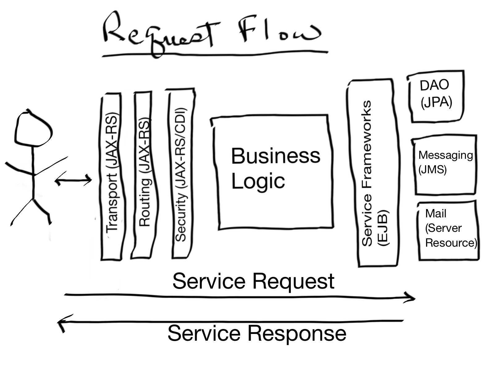

### SHAPE Service Developer Guide

#### Overview
This application is the service layer for the SHAPE GUI. This guide will discuss various technical details of the
service layer. For a discussion of the business requirements and design artifacts see the SHAPE design documentation.

The application uses typical JEE design approaches. It is deployed on JBoss's [Wildfly Swarm](http://wildfly-swarm.io/). 
This allows for easy configuration and application execution. See the Wildfly Swarm documentation for the many 
advantaged of developing with Swarm.

The applications packaging is divided into the following packages:
  * crosscutting - Application wide security and logging
  * frameworks - Primarily data access
  * gateway - Servicing REST requests
  * shared - Artifacts shared between the business layer (use cases) and the rest of the application
  * usescases - Business logic components

#### General Approach to Servicing Requests

The application uses a very typical JEE approach to servicing requests. Various frameworks and architectural approaches
such as REST, JAX-RS, JPA, EJB, JMS, and CDI are employed. Requests are received and routed through a transport 
gateway developed using JAX-RS. Security is handled using JAX-RS filters. Valid requests are delivered to business
logic components. These components leverage EJB service components to perform various tasks such as retrieving and 
persisting data and sending email.

#### Data Persistence View

#### Security View 

#### Transport View
The application uses the JaxRS framework to handle incoming service requests and outgoing 
service responses. The framework allows for the development of various filters which
are used to provide application wide security, logging, and XSS protection to name a few.

The transport gateway contains all the REST interfaces. They can be found in the 
*gateway.rest.services* package. These are provided in this format mainly to be used by java
client applications. The interfaces are annotated with JaxRS annotations and could be consumed 
by a java JaxRS client to quickly generate code to connect to the service layer.

#### Business Logic View
The service layer services all client requests. Services may be annotated with application 
specific annotations to implement specific behavior. For example, service methods that require
user authentication are annotated with the @Secure annotation (see crosscutting.security.rest.annotations.Secure).

|Service Name|Resource URL|Responsibility|
|:-----------|:-----------|:-------------|
|Activate_Organization_ServiceAdapter|/shape/admin/organization/activate|Set a Organization to active|
|Activate_Provider_ServiceAdapter|/shape/admin/provider/activate|Set a Provider to active|
|Activate_User_ServiceAdapter|/shape/admin/activate/{targetUserId}|Activate a user|
|Add_Measure_ServiceAdapter|/shape/admin/measure/add|Create a new measure|
|Add_Organization_Measure_ServiceAdapter|/shape/common/organization_measure/add|Add an Organization Measure|
|Add_Organization_Measure_Upload_ServiceAdapter|/shape/admin/measure/add/upload|Upload a file with organization measure data and create a new organization measure from it|
|Add_Organization_ServiceAdapter|/shape/admin/organization/add|Add a new Organization|
|Add_Organization_Stratification_ServiceAdapter|/shape/common/organization_stratification/add|Add a new Organization Stratification|
|Add_Organization_Stratification_Upload_ServiceAdapter|/shape/admin/stratification/add/upload|Upload a file with Organization Stratification information and save it to|
|Add_Provider_ServiceAdapter|/shape/admin/provider/add|Add a Provider|
|Add_User_Account_ServiceAdapter|/shape/admin/create/user|Add a new User|
|Change_Password_ServiceAdapter|/shape//common/changepassword|Change a users password|
|Delete_Organization_Measure_ServiceAdapter|/shape/admin/organization_measure/delete|Delete and organizational measure|
|Edit_Measure_ServiceAdapter|/shape/admin/measure/edit|Edit a Measure|
|Edit_Organization_ServiceAdapter|/shape/admin/organization/edit|Edit an Organizational|
|Edit_Organization_Stratification_ServiceAdapter|/shape/common/organization_stratification/edit|Edit an Organization Stratification|
|Edit_Provider_ServiceAdapter|/shape/admin/provider/edit|Edit a Provider|
|Edit_User_Account_ServiceAdapter|/shape/common/account/edit|Edit the User account|
|Edit_User_ServiceAdapter|/shape/admin/user/edit|Edit user account|
|Find_Aggregate_Comparison_ServiceAdapter|/shape/common/show/aggregateComparison/{measureId}/{year}|Find measure comparison information|
|Find_All_Aggregate_Comparison_ServiceAdapter|/shape/common/show/aggregateAllComparison/{measureId}|Find all aggregate measure comparisons|
|Find_All_Measures_ServiceAdapter|/shape/common/measure/findAll|Find all measures|
|Find_All_Organization_Measures_By_Organization_ServiceAdapter|/shape/common/organization_measure/findAllByOrg/{orgId}|Find all Organization Measures by Organizations|
|Find_All_Organization_Measures_Detail_By_Organization_ServiceAdapter|shape/common/organization_measure/findAllByOrg/{orgId}|Find all Organization Measures Detail by Organization|
|Find_All_Organization_Measures_ServiceAdapter|/shape/common/organization_measure/findAll|Find all Organization Measures|
|Find_All_Organization_Stratifications_By_Organization_ServiceAdapter|/shape/common/organization_stratification/findAllByOrg/{orgId}|Find all organization stratification for an organization|
|Find_All_Organization_Stratifications_ServiceAdapter|/shape/common/organization_stratification/findAll|Return all organization stratification|
|Find_All_Organizations_ServiceAdapter|/shape/admin/organization/findAll|Find_All_Organizations_ServiceAdapter|
|Find_All_Providers_ServiceAdapter|/shape/common/provider/findAll|Find all providers|
|Find_All_Users_ServiceAdapter|/shape/admin/user/findAll|Find all users|
|Find_App_Hist_Demographic_ServiceAdapter|/shape/common/show/appHistDemographic/{orgId}/{measureId}/{year}|Find the demographic history for an organization, measure and year|
|Find_Measure_By_Id_ServiceAdapter|/shape/common/find/measure_by_id/{measureId}|Find a measure by its ID|
|Find_Measure_ServiceAdapter|/shape/admin/measure/select|Select a measure for an organization|
|Find_Measures_By_Id_ServiceAdapter|/shape/admin/find/measureById|Find a measure by its ID|
|Find_User_By_Id_ServiceAdapter|/shape/admin/user/find/{targetuserid}|Find a user by their ID|
|Forgot_Password_ServiceAdapter|/shape/common/forgotpassword|Return a challenge question so the user can reset their ID|
|Forgot_Username_ServiceAdapter|/shape/common/forgotusername|Return the users user name from their email address|

#### Misc
email, 

#### Shared Code
Shared code is code that is shared between the framework layers and the business logic layer of the 
application. This package (*shared*) contains various utilities that assist with JWT token
creation and parsing, application exception handling, and primarily data transfer objections or 
DTOs. DTOs are used to carry data from the framework layer to the service layer and vice versa. 

Although many DTOs mimic entity beans that are present in the framework layer many do not.
Some would consider the presence of DTOs in this context as an anti-pattern, however there are 
reasons why this approach was chosen. First, in many cases the entity bean layer, being course grained, is not 
granular enough to support the service layers requirements. Second, there was a conscious effort
made during the development process to uncouple the business layer from the frameworks layers, such
as JPA. That being the case, for convenience and easy of understanding of the business logic, 
almost all business logic components utilize enterprise java beans (EJBs) and thus have data access 
object (DAO) stateless session beans injected by way of the @EJB annotation. 

#### Wildfly Swarm Specific Features

#### Building and Running the Application 